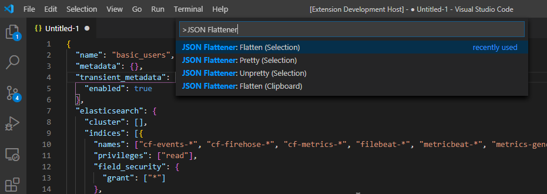
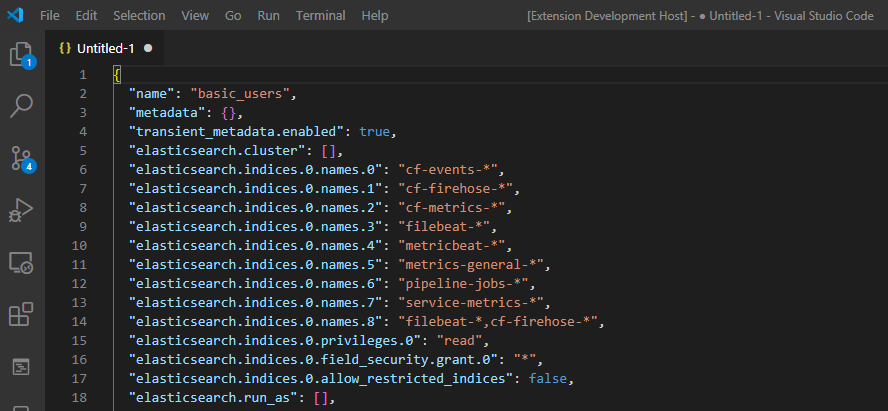

# **json-flattener - README**

This package is an extension for Visual Studio Code (VS Code) that provides commands to flatten multi-level JSON definitions to single-level dot notation.

## Features

- Supports flattening a JSON object marked as the editor selection
- Supports flattening a JSON object present in the clipboard
- Supports prettying (reformatting) JSON
- Suppports unprettying (reformatting "tight")

## Commands Provided By The Extension

> Warning: In all of the commands below, the original text is replaced with the converted text. This means **the original text is lost**(although you can use Undo to restore it).

There are four commands provided by this extension:

## Flatten (Selection) `appurist.json-flattener.selection`

This is the primary function of this extension. It converts a multi-level JSON, *marked by the current editor text selection*, into  single-level dot-notation JSON block. Once converted, it *replaces* the current selection with the new JSON flattened object. See images below.

## Flatten (Clipboard) `appurist.json-flattener.clipboard`

This is the alternate form. It also converts a multi-level JSON into  single-level dot-notation JSON block, however it looks for the source text in the clipboard. Once converted, it *replaces* the current clipboard with the new JSON flattened object.

## Flatten (Selection) `appurist.json-flattener.pretty`

This is a convenience function, provided because it was almost free to do so. It simply applies a 2-space JSON "pretty" stringify reformatting of the current selection.

## Flatten (Selection) `appurist.json-flattener.unpretty`

This is a convenience function, provided because it was almost free to do so. It simply applies a minimal JSON "unpretty" stringify reformatting of the current selection without much whitespace.

# Visual Demo
Before flattening:

After flattening:

## Extension Settings

There are no configurable settings for this extension at this time.

## Known Issues

None.

## Release Notes

### 1.0.0

Initial release of this JSON Flattener.
